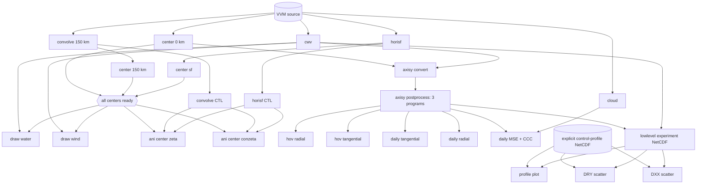

# RRCE workflow：現況分析與實作架構

## 1. 目標與邊界

workflow 接受兩項主要輸入：一個明確指定的 `config.py` 路徑，以及一組明確指定的 case index。它先產生完整計畫供人工 review，再用 Slurm `sbatch --dependency=afterok:JOB_ID` 建立依賴關係。

本設計不直接改寫現有 `cwv/run.sh`、`convolve/run.sh` 等檔案，也不把 job ID 寫回來源檔。每次執行的所有衍生檔都放在獨立的 `workflow/runs/<run_id>/`。render 遇到既有輸出時會在 `plan.tsv` 逐項標記 collision，但不覆蓋；普通 submit 遇到任何 collision 就停止。只有額外執行 `submit --allow-overwrite` 才允許覆蓋 review 過的確切檔案或目錄。

`config.py` 路徑、case indexes、run ID、繪圖項目、輸出名稱與外部輸入都沒有預設值。缺少任何必填值時，只列出錯誤，不產生可提交計畫。Slurm 與 runtime 值使用使用者本次明確指定的設定，以及現有各目錄 `run.sh` 的 stage-specific 設定；解析後仍全部展開到 lock manifest 與產生的 sbatch，供人工 review。

## 2. 現有程式的 case 選擇方式

以下 Python 程式都以整數 `iexp` 讀取 `config.expList[iexp]`，並使用同一位置的 `config.totalT[iexp]`：

- `cwv/wp.py`
- `convolve/cal_convolve.py`
- `horisf/cal_sf_fft.py`
- `find_center/find_center_domain_mean.py`
- `find_center/find_center_domain_mean_sf.py`
- `cloud/find_cloud.py`
- `axisy/cal_axisy.py`
- `axisy/cal_axisymmetricity.py`
- `axisy/cal_process_axisymmetricity.py`
- `axisy/cal_axisymmetricity_daily.py`
- 四個 `axisy/draw_*.py`

這些程式使用 `sys.path.insert(1, '../'); import config`，因此目前不能安全地從命令列選擇任意 config 檔。單純設定 `PYTHONPATH` 也不夠可靠，因為 repo 根目錄仍會被插入搜尋路徑。

實作時使用 `run_with_config.py`：它先以 `importlib` 載入 manifest 指定的檔案，註冊為 `sys.modules['config']`，再以 `runpy.run_path()` 執行目標程式。MPI job 的每個 rank 都透過這個 adapter 啟動，來源 `config.py` 不需更名或覆蓋。adapter 會把工作目錄切到目標程式所在目錄，以保留目前程式對 `../` 與相對圖檔路徑的假設。

## 3. 實際資料契約

| 節點 | 主要程式 | 直接輸入 | 主要輸出 |
|---|---|---|---|
| `cwv` | `cwv/wp.py` | VVM thermodynamic data | `data/wp/<exp>/wp-*.nc` |
| `convolve_150km` | `convolve/cal_convolve.py` | VVM dynamic data | `data/convolve/<exp>/150km/conv-*.nc` |
| `convolve_ctl` | per-case CTL renderer | `convolve_150km`、CTL template | `data/convolve/<exp>/convolve.ctl` |
| `horisf` | `horisf/cal_sf_fft.py` | VVM dynamic data | `data/horimsf/<exp>/horimsf-*.nc` |
| `horisf_ctl` | scoped form of `generate_ctl.sh` | `horisf` | `data/horimsf/msf_<exp>.ctl` |
| `center_0km` | `find_center_domain_mean.py <case> 0km` | VVM dynamic data | `data/find_center/czeta0km_positivemean/<exp>.txt` |
| `center_150km` | `find_center_domain_mean.py <case> 150km` | `convolve_150km` | `data/find_center/czeta150km_positivemean/<exp>.txt` |
| `center_sf` | `find_center_domain_mean_sf.py <case>` | `horisf` | `data/find_center/sf_positivemean/<exp>.txt` |
| `cloud` | `cloud/find_cloud.py` | VVM thermodynamic/dynamic data | `data/cloud/<exp>/cld_*.txt`, `ccc_*.txt` |
| `axisy_convert` | `axisy/cal_axisy.py` | VVM data、`cwv`、`center_0km` | `data/axisy/czeta0km_positivemean/<exp>/axisy-*.nc` |
| `axisy_reduce` | `cal_axisymmetricity.py` | `axisy-*.nc` | `axmean-*.nc` |
| `axisy_process` | `cal_process_axisymmetricity.py` | `axisy-*.nc` | `axmean_process-*.nc` |
| `axisy_daily` | `cal_axisymmetricity_daily.py` | `axisy-*.nc` | `axmean_daily-*.nc` |
| `axisy_draw_hov` | `draw_hov_inflow.py` | `axmean_process-*.nc` | Hovmöller/series PNG |
| `axisy_draw_tang/radi` | daily draw scripts | `axmean_daily-*.nc` | daily PNG |
| `axisy_draw_mse_ccc` | `draw_mse_ccc_daily.py` | `axmean_daily-*.nc`、`center_0km`、`cloud/ccc_*.txt` | daily PNG |
| `lowlevel_exp` | `cal_axisy_exp_daily.py` | `axmean-*.nc`、`axmean_process-*.nc`、`wp-*.nc` | 一個實驗組 NetCDF |
| `lowlevel_profiles` | `plot_inflow_cwv_sep.py` | control/experiment daily-profile NetCDF | profile PNG |
| `lowlevel_scatter_dry/dxx` | scatter scripts | control daily-profile NetCDF + **單一** experiment daily-profile NetCDF | 每實驗組各一張 scatter PNG |

`axisy/run2.sh` 現在把 reduce、process、daily 三步放在同一 job 中並依序執行。因此第一版保留一個 `axisy_postprocess` job；job 內任何命令失敗都必須立刻退出（`set -euo pipefail`），確保 `afterok` 的語意可信。

## 4. 依賴圖

每個方框是一個 stage job；同一個 stage job 會依照 manifest 的 case index 順序執行全部實驗。一次 `rrce-workflow submit` 會提交整張 DAG 中所有選擇為 `run` 的 stage jobs。某個 stage 內任一實驗失敗時，job 立即失敗，所有以 `afterok` 依賴該 stage 的工作都不會開始。圖中的 join 是 workflow 內部節點，不會執行分析程式。



實際送件時，每個下游 stage job 的 dependency 是其所有直接父 stage job ID 以冒號串接，例如：

```text
sbatch --parsable --dependency=afterok:<cwv_job>:<center0_job> axisy_convert.sbatch
```

如果前置資料由先前工作完成，而 manifest 選擇 `reuse`，它沒有本次 job ID；preflight 必須逐檔驗證完整性，通過後才將該父節點視為 satisfied。不能因為目錄存在就略過。

這裡的「一個 submit」指一次 workflow submit 命令。它會依序取得每個 stage 的 job ID 並提交其下游；不是把所有分析塞進同一個 Slurm job。每個 stage 仍是獨立 job，才能使用不同 partition/resource 並正確表達依賴。

## 5. 和原需求文字不同、必須修正的依賴

1. `draw_water.gs` 與 `draw_wind.gs` 不只讀 CWV。兩者都讀 0 km、150 km、stream-function 三種 center 檔，因此應等待 `cwv + center_0km + center_150km + center_sf`。
2. `axisy/cal_axisy.py` 的 data collector 直接開啟 `data/wp/<exp>/wp-*.nc`，所以 `axisy_convert` 必須等待 `cwv + center_0km`。這和需求描述一致，但不是只靠 center 就能跑。
3. `draw_mse_ccc_daily.py` 還會讀 `data/cloud/<exp>/ccc_*.txt`，必須額外等待 cloud job。
4. `ani_center/draw_zeta.gs` 和 `draw_conzeta.gs` 除三種中心檔之外，還開啟 horisf 與 convolve 的 GrADS control file；這些 control file 的產生方式目前不在列出的計算腳本中，需列為外部必填輸入或補上產生節點。

## 6. 需要修改或包裝的地方

### Slurm shell scripts

不再用 `sed` 修改 repo 內的 `run.sh`。`workflow/templates/*.sbatch` 為每個 stage 產生一份 job script，其中明列該 stage 要依序執行的所有 case indexes，case 與資源都直接寫進產生檔供 review。

現有腳本有幾個不能直接沿用的問題：

- case 範圍寫死為 `seq`，且不同檔案目前已有人工作中的未提交修改。
- `find_center/run.sh` 使用未在檔內定義的 `ncpu`。
- `axisy/run2.sh` 寫死舊 job ID `974035`。新架構只在呼叫 `sbatch` 時加 dependency，不把 ID 寫入 script。
- 多數腳本沒有 `set -euo pipefail`；前段失敗仍可能讓 job 以成功結束，會破壞 `afterok`。
- stdout 檔名過於通用。產生檔改用 manifest 明確指定的 log root，並包含 run ID、stage、case 與 `%j`。

stage job 內的 case loop 形式如下；cases 會在 render 時展開成明確整數，不使用 `seq` 推測範圍：

```bash
set -euo pipefail
source ~/.bashrc
mamba activate py311
for case_index in <rendered-case-indexes>; do
    <stage command using run_with_config.py>
done
```

目前採用的 runtime 是 `mamba activate py311`，GrADS executable 是 `/work1/umbrella0c/opengrads-hpc-1.0.8-linux-x86_64/opengrads`。計算 stage 的 partition/tasks 由相對應的現有 run script 帶入：CWV 使用 ct112/72、convolve 使用 ct448/217、horisf 使用 ct112/72、三種 center 使用 ct112、cloud 使用 ct112/112、axisy convert 使用 448-core partition/217 ranks。`axisy/run2.sh` 宣告 45 tasks 卻執行 72/217-rank 的 MPI 命令，不能原樣使用；`axisy_postprocess` 應配置至少 217 tasks 的 448-core partition，或之後拆成不同資源的 jobs。GrADS stage 使用 `ct112,cf112`、112 tasks，並以最多 112 個背景程序分批執行，`wait` 後才啟動下一批。account 沿用現有 run scripts 的 `MST114418`。

### Python config adapter

`run_with_config.py` 介面必須明確包含：

```text
run_with_config.py --config <absolute_config.py> --script <absolute_script.py> -- <script args...>
```

它需驗證 config 是一般檔案、可匯入、`expList`/`totalT` 等長、case index 不重複且在範圍內、每個 case 有 `expdict` label，以及 `vvmPath`/`dataPath` 是明確絕對路徑。驗證結果寫入 lock manifest，其中保存 config 的 SHA-256；submit 前再次比對，避免 review 後 config 被更改。

### GrADS scripts

四個 `.gs` 目前都先設定一套 RRCE list，隨後又無條件設定另一套 cluster list，前一套實際會被覆蓋。`draw_wind.gs` 在 control case 分支還引用未定義的 `tlastList`。不能只修改「前面的 case 數量」。

render 階段要為每個 case 產生獨立 `.gs` 副本，直接固定以下四個已驗證值，不再靠 GrADS list index 推導：

- 完整 experiment name：`config.expList[case]`
- label：`config.expdict[experiment]`
- timestep count：`config.totalT[case]`
- data/output root：manifest 的明確路徑

產生檔放在 `workflow/runs/<run_id>/rendered/grads/<stage>/<case>/`，執行時仍以原 GrADS 目錄為 cwd，讓其餘 helper 能被找到。所有輸出目錄須含 run ID 或 manifest 指定的 dataset tag，且 render 時驗證不存在。

需求中的 wind 目標已確認為 `ani_water_wind/draw_wind.gs`。

horisf CTL 以 `data/horimsf/generate_ctl.sh` 為來源邏輯，但不直接執行目前會掃描並覆寫全目錄的版本。workflow 產生只涵蓋本次 cases 的 stage script，輸出 `data/horimsf/msf_<exp>.ctl`，其中 `TDEF` 使用 lock manifest 的 `totalT`。convolve CTL 以 `data/convolve/convolve.ctl` 為格式來源，為每個 case 產生 `data/convolve/<exp>/convolve.ctl`；`TDEF` 同樣使用 `totalT`。目前只計算 150 km，因此產生的 CTL 不應宣告不存在的 100/50/25 km ensemble；`EDEF` 必須與實際 kernel 清單一致。CTL stage 分別依賴 horisf 與 convolve 計算完成，center animation 再依賴這兩個 CTL stage。

### axisy 繪圖

`draw_hov_inflow.py` 現在靠註解/取消註解切換 radial 與 tangential wind。需把共用繪圖邏輯改成函式，加入必填 `--component radial|tangential`；workflow 產生兩個獨立 job，輸出名稱包含 component。不能在執行前自動改原始註解。

`axisy/run_draw.sh` 現在接受 `${1}` 作為 script，但 case 固定 `0..4`。新模板應逐一寫出 manifest 的 case，並讓四個 requested draw programs 都是清楚可見的命令。MSE/CCC job 另加 cloud dependency。

### lowlevel daily NetCDF 與 plots

`cal_axisy_exp_daily.py` 的 `OUT_FILENAME` 固定為 `axisy_exp_daily_profiles.nc`，`main()` 也沒有輸出參數，目前會覆蓋同名舊資料。需加入必填 `--output-nc`，並以「寫到同目錄暫存檔、關閉成功、原子 rename」完成；若目標已存在則失敗，除非本次 submit 明確使用 `--allow-overwrite`。

`plot_inflow_cwv_sep.py` 的 `__main__` 同時硬編 control、new experiment 與註解中的 origin 路徑。需改為必填 CLI：`--input-nc`、`--dataset-kind`、`--dataset-tag`、`--output-dir`、`--days`、`--center-flag`，所有輸出都放入 dataset tag 專屬目錄。

兩個 scatter 程式的 `main()` 已支援多個 y source，但檔尾仍硬編 `dpath1/dpath2`、`newrun` 與 marker 清單。本次「一個實驗組一張圖」模式應提供必填的單一 `--experiment-nc`、`--source-name`、`--marker`、`--output-png`，並禁止一次傳入兩個 experiment NetCDF。已指定的 dataset 對應是 `axisy_exp_daily_profiles_origin.nc -> f10_origin`、`axisy_exp_daily_profiles.nc -> f20`，marker 基本形狀使用圓形；`f10_HomogRad` 與未來實驗也各用不同 dataset tag 和輸出檔名，不在 Python 中維護 dpath1/dpath2。

整數 restart day 與其附近的小數 restart-day ensemble 都要納入。依目前文字，marker 語意暫記為「整數日實心圓、小數日空心圓」，此規則已由使用者確認，manifest 明確記錄 filled/hollow。case 分組應由 `case_day` 數值判斷，不再維護長串 `special_o_exps`。若小數日需要保留 DXX/dry-fraction 顏色，空心圓的 edge color 應使用對應 colormap，而不是目前固定黑色。

control x-axis 資料 `axisy_ctrl_daily_profiles.nc` 由 `cal_axisy_ctrl_daily.py` 產生，但不在本次需求的計算清單內。因此 manifest 必須明確選擇：提供既有 control 檔並驗證，或把 control 計算納入 DAG。workflow 不作選擇。

## 7. 預計目錄與模組

```text
workflow/
├── README.md
├── ARCHITECTURE.md
├── manifest.example.yaml
├── bin/
│   ├── rrce-workflow              # plan/render/submit/status CLI
│   ├── run_with_config.py         # 注入指定 config，再執行既有 Python
│   └── run_python_callable.py     # 呼叫已改為參數化的 lowlevel/draw main
├── lib/
│   ├── manifest.py                # schema、必填欄位與 cross-field 驗證
│   ├── config_snapshot.py         # 載入/驗證 config、建立 hash lock
│   ├── contracts.py               # 各 stage 的 inputs/outputs/完整性檢查
│   ├── dag.py                     # 建圖、拓樸排序、父節點 job ID
│   ├── renderer.py                # 產生 sbatch/GrADS 副本，不改來源
│   ├── slurm.py                   # sbatch --parsable、ID 解析、state 寫入
│   └── state.py                   # 原子更新 jobs.json/events.jsonl
├── templates/
│   ├── python_mpi.sbatch
│   ├── python_serial.sbatch
│   ├── axisy_postprocess.sbatch
│   ├── grads.sbatch
│   └── grads_case.gs.tmpl
└── runs/
    └── <run_id>/
        ├── manifest.lock.yaml
        ├── config.snapshot.py
        ├── plan.tsv
        ├── dag.mmd
        ├── jobs/*.sbatch
        ├── rendered/grads/**
        ├── artifacts/
        │   ├── data/              # 按 stage/case 連到實際資料目錄或檔案
        │   ├── ctl/               # 連到本次使用的所有 CTL
        │   └── figures/           # 按產品/case 連到圖片目錄
        ├── artifacts.tsv          # link、實際目標、producer job、狀態
        ├── state/jobs.json
        └── state/events.jsonl
```

`runs/<run_id>` 的建立採 exclusive create；run ID 已存在就失敗。`manifest.lock.yaml` 記錄每個 case 的 index、experiment、label、totalT、所有 input/output 絕對路徑、來源檔與 config hash。這是 submit 的唯一輸入，避免 submit 階段重新解讀已改變的 config。

`artifacts/` 只保存 symlink，不搬移大型 NetCDF 或圖片。render 時建立連到預期位置的 links，因此 job 尚未完成時可以是 dangling link；`status` 會在 `artifacts.tsv` 標示 planned/available/invalid。對大量逐時檔案，link 指向 case 或產品目錄，不為每一個檔案建立 symlink。CTL 使用單檔 link。這個索引資料夾讓人能從單一 run directory 找到該次計算的資料、CTL 與圖片。

## 8. CLI 流程與人工 review 點

1. `rrce-workflow plan --manifest <file>`：只驗證 config、case、路徑、stage 與 DAG；輸出解析結果，不寫 run 目錄。
2. `rrce-workflow render --manifest <file>`：建立新的 run 目錄，寫入 lock manifest、完整 `plan.tsv`、DAG、所有 sbatch 與 GrADS 副本。此步不呼叫 Slurm。
3. 人工 review `manifest.lock.yaml`、`plan.tsv`、`jobs/*.sbatch`、rendered `.gs`。因為值都已展開，review 不需追 shell 變數。
4. `rrce-workflow submit --run-dir <exact path>`：再次驗證 hash、輸出不存在與 dependency DAG，依拓樸順序呼叫 `sbatch --parsable`。每取得一個 job ID 就原子寫入 `jobs.json`。若 review 過的計畫包含既有輸出，必須額外使用 `--allow-overwrite`；沒有此旗標就拒絕提交。
5. 若提交到一半失敗，停止提交新的下游 job；已提交 job 不自動取消。state 清楚列出 submitted/failed/not-submitted，交由人決定。
6. `rrce-workflow status --run-dir <exact path>`：只讀 `jobs.json` 並查詢 Slurm，不變更 job。

`submit` 不接受 manifest，僅接受已 render 且未被修改的 run directory，確保人工看到的檔案就是實際提交內容。

## 9. stage 狀態與避免覆蓋

每個 stage 在 manifest 中必須明確指定 `action: run` 或 `action: reuse`，沒有隱含值：

- `run`：普通 submit 時所有預期輸出路徑必須不存在；存在即停止。只有額外 `--allow-overwrite` 才可執行 render 時已列出的 overwrite targets。
- `reuse`：不提交 job，但所有預期檔案、時間範圍、必要 NetCDF variables 必須通過 contract check。

不能只用一個 `_SUCCESS` 空檔判斷完成。檢查至少包含期望 timestep 範圍、最後一個檔案可開啟、必要 variables，以及中心文字檔資料列數。成功 job 最後才由模板寫入 run-specific receipt；receipt 記錄輸出檢查結果與來源 hash，不放進共享科學資料目錄。

## 10. 已發現的風險與待確認問題

繪圖語意已確認：

整數 restart day 畫實心圓，對應的小數 restart day ensemble 畫空心圓。

其餘執行決策已固定：cloud 是獨立的 `find_cloud.py` stage；(a) 0 km、(b) 150 km、(c) stream-function 是三個 center stages；`axisy_postprocess` 先維持單一 448-core partition stage 並配置至少 217 tasks；convolve CTL 只宣告實際產生的 `EDEF 1 NAMES 150km`；原本會在 login node 執行的 Python 繪圖也改由 Slurm stage 提交；四個 GrADS 產品 water、wind、center zeta、center conzeta 都執行每個 case 的 `1..totalT`。未指定 walltime 時不自行加入值，保留該系統的 partition policy。

工作樹中的 `config.py`、五個 run scripts 與 `axisy/run.sh` 已有未提交修改；本設計沒有碰觸它們，後續實作也應把它們視為使用者內容並避開。

## 11. Dry-run 與多 config 實驗組命名

本節為已確認需求；CLI 尚待依此規格實作。

- 提供 --dry-run：列出解析後的 config、case index/完整實驗名稱、dataset_tag、每個 stage 的指令與資源、輸入輸出、重用/衝突、完整 DAG，以及預期建立的 artifact links。
- dry-run 不呼叫 sbatch、不執行科學計算或繪圖、不建立 run 目錄或 symlinks、不覆蓋產物，也不更改提交 state。config 載入停用 bytecode 寫入；config 本身必須是無寫入副作用的設定模組。
- 支援 submit --run-dir <path> --dry-run，驗證已 render 的計畫並顯示預期送件。尚未提交的父節點使用 <JOB_ID:stage> 佔位符；不能虛構真實 job ID。尚待上游生成的輸入標示 pending，不當作既有可讀產物。
- --dry-run 與 --allow-overwrite 同時出現仍只預覽；列出受影響的精確產物，沒有寫入權能。缺少必填、非法 case 或未允許的碰撞回傳非零狀態，報告仍列出所有可解析項目。
- render 負責將可 review scripts 寫入獨立 run 目錄；dry-run 是不落盤的預覽，兩者使用同一個 planner，避免預覽與提交兩套邏輯。

組名解析：
1. 明確提供 --dataset-tag 或 manifest run.dataset_tag 時使用該值；CLI 與 manifest 同時存在卻不同則報錯。
2. 沒有明確組名時，僅從 config_<name>.py 的 basename 移除前綴 config_ 與副檔名 .py，保留大小寫與其餘 underscores。例如 config_f10_HomogRad.py 得到 f10_HomogRad。
3. config.py、config_.py 或不符合此命名規則的檔名必須明確提供 dataset_tag，不能從第一個 experiment 或目前 repo config 猜測。
4. dataset_tag 必須是非空的單一路徑元件，禁止路徑分隔符與 . 或 ..；允許字母、數字、底線與連字號。解析結果及其來源 explicit/config_filename 寫入 plan 與 lock manifest。
5. 本次組名是 f10_HomogRad。這不要求複製、改名或覆蓋現有 config.py；可使用 config.py 搭配明確組名，也可日後提供 config_f10_HomogRad.py。
6. dataset_tag 為一組實驗的識別；run_id 為一次執行的識別，兩者不可混用。相同組名可以有多次 run，但輸出衝突規則仍適用。
7. lowlevel 與 scatter 都引用解析後的 run.dataset_tag，禁止各自推導不同組名。新輸出使用 axisy_exp_daily_profiles_<dataset_tag>.nc，圖檔依 dataset_tag 區分；既有 f10_origin/f20 檔名對應照常保留，不自動搬移。
8. 整數日使用 filled 圓形、小數日 ensemble 使用 hollow 圓形，已確認；不再保留待確認 placeholder。

預計介面（以下為規格示例，尚非可執行命令；CASES 必須明確提供）：

```bash
rrce-workflow plan --config config_f10_HomogRad.py --cases CASES --dry-run
rrce-workflow plan --config config.py --dataset-tag f10_HomogRad --cases CASES --dry-run
rrce-workflow submit --run-dir workflow/runs/RUN_ID --dry-run
```

驗收：測試檔名推導、多 underscores、explicit 組名、組名衝突、config.py 缺組名；以假 sbatch 驗證 dry-run 呼叫次數為零，並比較執行前後產物/run/state 目錄沒有改動。相同輸入的 dry-run 與 render 必須產生相同 stage/case/DAG 計畫。
